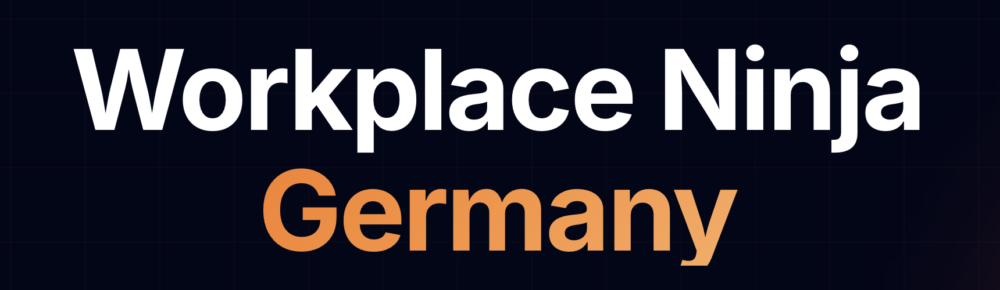

  

# Workplace Ninja Germany - Slides Archive

The official slides archive for [Workplace Ninja Germany](https://www.wpninjas-germany.com) -- Germany's premier Microsoft Modern Workplace conference.

Workplace Ninja Germany is a community-driven, vendor-neutral platform dedicated to sharing practical, real-world knowledge about the Microsoft Modern Workplace. We bring together IT professionals, architects, and security leaders to share best practices and deep technical insights.

Part of the global Workplace Ninja community. By the community, for the community.

## 2026 Edition - Munich

- **Date:** March 9, 2026
- **Location:** Microsoft Germany HQ, Munich
- **Attendees:** 178
- **Speakers:** 20
- **Sessions:** 22
- **Language:** English

### Session Slides

| Session | Speaker(s) |
|---|---|
| [A practical guide to Application Control for Business](2025/A%20practical%20guide%20to%20Application%20Control%20for%20Business%20-%20Kim%20Oppalfens%2C%20Tom%20Degreef.pdf) | Kim Oppalfens, Tom Degreef |
| [Are you ready for Intune Suite](2025/Are%20you%20ready%20for%20Intune%20Suite%20-%20Michael%20Meier.pdf) | Michael Meier |
| [Don't bother your users with MDM, embrace modern!](2025/Don%E2%80%99t%20bother%20your%20users%20with%20MDM%2C%20embrace%20modern%21%20-%20Peter%20Daalmans.pdf) | Peter Daalmans |
| [Intune Admins in the Age of AI](2025/Intune%20Admins%20in%20the%20Age%20of%20AI%20-%20Esther%20Barthel.pdf) | Esther Barthel |
| [OpenIntuneBaseline 101 - Intune Easy Mode](2025/OpenIntuneBaseline%20101%20-%20Intune%20Easy%20Mode%20-%20James%20Robinson.pdf) | James Robinson |
| [Pack & Deploy - Mastering Win32 Apps with PSADT](2025/Pack%20%26%20Deploy%20-%20Mastering%20Win32%20Apps%20with%20PSADT%20-%20Maxime%20Guillemin%2C%20Joery%20Van%20den%20Bosch.pdf) | Maxime Guillemin, Joery Van den Bosch |
| [Patched, but hacked - The illusion of Intune compliance](2025/Patched%2C%20but%20hacked%20-%20The%20illusion%20of%20Intune%20compliance%20-%20Lee%20Schlipphak.pdf) | Lee Schlipphak |
| [Refresh your CA Policy - Whats new in Conditional Access](2025/Refresh%20your%20CA%20Policy%20-%20Whats%20new%20in%20Conditional%20Access%20-%20Tim%20Wolf%2C%20Jonathan%20Towles.pdf) | Tim Wolf, Jonathan Towles |
| [Simplifying Android Enterprise Management](2025/Simplifying%20Android%20Enterprise%20Management%20-%20Nicky%20De%20Westelinck.pdf) | Nicky De Westelinck |
| [The 2025 Intune Toolkit - Must-Have Community Tools for Intune Admins](2025/The%202025%20Intune%20Toolkit%20-%20Must-Have%20Community%20Tools%20for%20Intune%20Admins%20-%20Oktay%20Sari%2C%20Somesh%20Pathak.pdf) | Oktay Sari, Somesh Pathak |
| [The Top 5+ Do's, Don'ts & How's of Azure Virtual Desktop](2025/The%20Top%205%2B%20Do%E2%80%99s%2C%20Don%E2%80%99ts%20%26%20How%E2%80%99s%20of%20Azure%20Virtual%20Desktop%20-%20Marcel%20Meurer.pdf) | Marcel Meurer |
| [The Windows 365 Experience - Boot, App & Link - Live!](2025/The%20Windows%20365%20Experience%20-%20Boot%2C%20App%20%26%20Link%20-%20Live%21%20-%20Jon%20Jarvis.pdf) | Jon Jarvis |
| [Top 10 Learnings from Intune Projects](2025/Top%2010%20Learnings%20from%20Intune%20Projects%20-%20Florian%20Salzmann%2C%20Jannik%20Reinhard.pdf) | Florian Salzmann, Jannik Reinhard |
| [Windows Resiliency - Is your WinRE healthy](2025/Windows%20Resiliency%20-%20Is%20your%20WinRE%20healthy%20-%20Martin%20Himken%2C%20Johannes%20Geir%20Kristjansson.pdf) | Martin Himken, Johannes Geir Kristjansson |

### Topics

- Microsoft Intune & Endpoint Management
- Microsoft Defender & Threat Protection
- Identity & Access Management
- Endpoint Analytics & Automation
- Device Management (Windows, macOS, Mobile)
- Zero Trust & Security Hardening

## Organizers

- Christian Lehrer
- Kyle Frieler
- Roman Kleyn (Microsoft MVP)
- Ugur Koc (Microsoft MVP)
